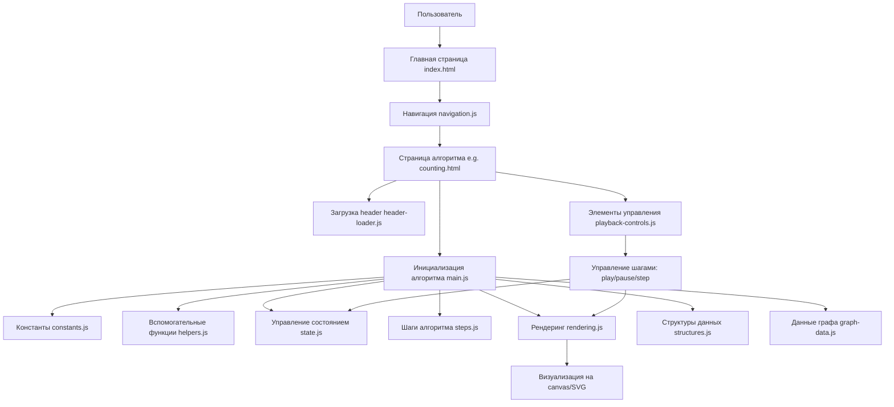

# Algorithm Visualizer

## 🎯 Executive Summary (Краткая суть)

Algorithm Visualizer — это интерактивный веб-сервис для пошаговой визуализации работы алгоритмов и структур данных на пользовательских входных данных.  
Миссия: Сделать изучение алгоритмов интуитивно понятным через визуализацию на своих данных, а не на абстрактных примерах.

| Параметр          | Значение                          |
|-------------------|-----------------------------------|
| Категория         | EdTech / Developer Tools / Learning Platform |
| Формат            | Веб-приложение (адаптивный дизайн) |
| ЦА                | Студенты технических специальностей, преподаватели АиСД, образовательные платформы |
| Ключевая ценность | Визуализация не на демо-примерах, а на данных пользователя — для глубокого понимания логики |
| Статус            | Прототип в разработке (хакатон) |

## 🔍 Проблема (Problem Statement)

### 2.1. Контекст
Алгоритмы и структуры данных (АиСД) — фундаментальная тема в компьютерных науках, но одна из самых сложных для восприятия. Студенты часто заучивают псевдокод, не понимая, как он исполняется в динамике. Преподаватели тратят значительное время на ручную отрисовку схем, вместо того чтобы объяснять суть.

### 2.2. Количественное подтверждение боли (экспериментальные данные)
Мы провели хронометраж двух лекций по АиСД в разных форматах:

| Параметр                  | Преподаватель 1          | Преподаватель 2          | Среднее |
|---------------------------|--------------------------|--------------------------|---------|
| Формат                    | Онлайн + планшет         | Офлайн + доска           | -       |
| Длительность пары         | 102 мин                  | 80 мин                   | -       |
| Время на ручную визуализацию | ~15 мин                 | ~17 мин                  | ~18%    |
| Доля времени              | 14.7%                    | 21.25%                   | ~18%    |

Пересчёт в «цену проблемы»:  
За один семестр (30 пар) один преподаватель тратит 7.5–8.5 часов только на перерисовку схем.  
Для кафедры из 10 преподавателей: 75–85 часов (≈2 рабочие недели) теряются суммарно.

### 2.3. Качественные боли по сегментам
👨‍🎓 **Студенты**  
- Не видят связь между строкой кода и действием на экране  
- Не понимают, почему алгоритм принял то или иное решение на конкретном шаге  
- Не могут «поиграть» с данными: ввести свой массив/граф и увидеть реакцию  
- Теряются в абстракциях: учебники дают статичные картинки, видео — пассивный просмотр  

👨‍🏫 **Преподаватели**  
- Тратят 15–20% лекционного времени на техническую отрисовку, а не на объяснение  
- Не могут быстро адаптировать пример под вопрос студента («а что если ввести [5,1,9]?»)  
- Онлайн-формат усугубляет проблему: рисовать в Zoom/Miro неудобно, нет анимации переходов  
- Нет единого инструмента под все темы курса: сортировки — один сайт, деревья — другой, графы — третий  

🏫 **Образовательные учреждения / платформы**  
- Низкая интерактивность контента снижает удержание и дифференциацию на рынке  
- Сложность масштабирования качественного объяснения: хороший преподаватель не может быть везде одновременно  
- Отсутствие аналитики: какие алгоритмы вызывают трудности у студентов, где нужны доработки  

## 👥 Целевая аудитория и стейкхолдеры

| Сегмент                          | Роль                          | Потребности                                                                 | Критерии успеха                                      |
|----------------------------------|-------------------------------|-----------------------------------------------------------------------------|-------------------------------------------------------|
| Студенты (бакалавриат, магистратура) | Конечные пользователи         | Понимать логику алгоритмов, готовиться к экзаменам/лабам, отработать сложные темы самостоятельно | Быстро разобрался, смог объяснить одногруппнику, получил хорошую оценку |
| Преподаватели АиСД               | Инициаторы внедрения, активные пользователи | Экономить время на подготовку, наглядно объяснять, адаптировать примеры «на лету» | Сэкономил 10+ минут на лекции, студенты стали задавать меньше уточняющих вопросов |
| Образовательные платформы (Stepik, Coursera, вузовские LMS) | Партнёры по интеграции       | Повысить интерактивность курсов, удержать аудиторию, получить аналитику по усвоению тем | Рост завершаемости курсов, положительные отзывы, возможность монетизации |
| Школы / олимпиадные кружки       | Дополнительные пользователи  | Быстро демонстрировать алгоритмы на тренировках, готовить учеников к соревнованиям | Ученики стали быстрее решать задачи на алгоритмы     |

## 💡 Решение (Product Concept)

### 4.1. Высокоуровневое описание
Algorithm Visualizer — это веб-приложение, в котором пользователь:  
- Выбирает алгоритм или структуру данных из каталога  
- Вводит свои входные данные (массив, узлы графа, значения дерева и т.д.)  
- Запускает пошаговую визуализацию: видит анимацию изменений, подсветку выполняемой строки кода, текстовые пояснения к шагам  
- Управляет воспроизведением: пауза, шаг вперёд/назад, сброс, регулировка скорости  
- (Опционально) Использует режим «Инструктор»: рисует поверх схемы, перемещает элементы, акцентирует внимание  

### 4.2. Ключевые принципы продукта
- **Пользовательские данные — основа, а не опция**: визуализация всегда строится на введённых пользователем данных  
- **Единый UX-паттерн**: одинаковый интерфейс для всех алгоритмов и структур (выбор → ввод → визуализация)  
- **Пошаговая прозрачность**: каждый шаг имеет состояние, действие и (опционально) пояснение  
- **Связь кода и визуализации**: подсветка строки кода, выполняемой в текущий момент  
- **Гибкость для преподавателя**: режим оверлея для рисования поверх, возможность вернуться к любому шагу  

## 🏗️ Архитектура и структура проекта

Проект построен на чистом фронтенде (HTML, CSS, JavaScript) с модульной архитектурой для лёгкого добавления новых алгоритмов. Нет зависимостей от внешних библиотек — всё работает на нативных технологиях браузера.

### Общая архитектура системы



### Детальное описание компонентов

#### Фронтенд-архитектура
- **HTML-страницы**: Каждая страница алгоритма (`pages/[algorithm].html`) включает общий header и специфический JS. Используется единый шаблон для консистентности.
- **JavaScript-модули**: Разделены на общие (`js/core/`) и алгоритм-специфические (`js/algorithms/[algorithm]/`). Каждый модуль отвечает за одну ответственность (принцип SRP).
- **CSS-стили**: Модульные стили в `css/`, с общими (`base.css`, `main.css`) и специфическими для алгоритмов (`algorithms/[algorithm].css`).

#### Ключевые модули по алгоритмам
Каждый алгоритм имеет папку с файлами:
- `constants.js`: Цвета, размеры, параметры визуализации.
- `helpers.js`: Утилиты (математические функции, валидация).
- `main.js`: Инициализация, настройка событий, интеграция модулей.
- `rendering.js`: Логика рисования (canvas/SVG), обновление DOM.
- `state.js`: Хранение текущего состояния (данные, шаг, переменные).
- `steps.js`: Определение последовательности шагов, логика переходов.
- `structures.js` (опционально): Реализации структур данных (графы, кучи).
- `graph-data.js` (опционально): Предопределённые данные для демонстрации.

#### Общие модули (`js/core/`)
- `navigation.js`: Управление переходами между страницами, меню.
- `playback-controls.js`: Кнопки управления (play, pause, step forward/backward, speed control).
- `header-loader.js`: Динамическая загрузка общего header (`pages/header.html`).

### Структура папок и файлов

```
Algorithm_Visualizer/
├── README.md                    # Этот файл
├── index.html                   # Главная страница с меню алгоритмов
├── counting.html                # Альтернативная страница для сортировки подсчётом
├── graph.html                   # Альтернативная страница для графов
├── css/                         # Стили
│   ├── base.css                 # Общие стили (шрифты, цвета, layout)
│   ├── main.css                 # Основные стили интерфейса
│   └── algorithms/              # Специфические стили
│       ├── counting.css         # Для сортировки подсчётом
│       ├── dijkstra.css         # Для алгоритма Дейкстры
│       ├── ford-fulkerson.css   # Для алгоритма Форда-Фалкерсона
│       └── kmp.css              # Для алгоритма Кнута-Морриса-Пратта
├── js/                          # JavaScript код
│   ├── core/                    # Общие компоненты
│   │   ├── header-loader.js     # Загрузка header
│   │   ├── navigation.js        # Навигация
│   │   └── playback-controls.js # Элементы управления
│   ├── algorithms/              # Алгоритм-специфические модули
│   │   ├── counting/            # Сортировка подсчётом
│   │   │   ├── constants.js     # Константы
│   │   │   ├── helpers.js       # Хелперы
│   │   │   ├── main.js          # Основная логика
│   │   │   ├── rendering.js     # Рендеринг
│   │   │   ├── state.js         # Состояние
│   │   │   └── steps.js         # Шаги
│   │   ├── dijkstra/            # Алгоритм Дейкстры
│   │   │   ├── constants.js
│   │   │   ├── helpers.js
│   │   │   ├── main.js
│   │   │   ├── rendering.js
│   │   │   ├── state.js
│   │   │   ├── steps.js
│   │   │   └── structures.js    # Структуры данных (граф, куча)
│   │   ├── ford-fulkerson/      # Алгоритм Форда-Фалкерсона
│   │   │   ├── constants.js
│   │   │   ├── graph-data.js    # Данные графа
│   │   │   ├── helpers.js
│   │   │   ├── main.js
│   │   │   ├── rendering.js
│   │   │   ├── state.js
│   │   │   └── steps.js
│   │   └── kmp/                 # Алгоритм КМП
│   │       ├── constants.js
│   │       ├── helpers.js
│   │       ├── main.js
│   │       ├── rendering.js
│   │       ├── state.js
│   │       └── steps.js
│   ├── counting_sort/           # Альтернативная реализация сортировки
│   │   ├── constants.js
│   │   ├── helpers.js
│   │   ├── main.js
│   │   ├── rendering.js
│   │   ├── state.js
│   │   └── steps.js
│   └── graph_deikstra/          # Альтернативная реализация Дейкстры
│       ├── graph.js             # Граф
│       ├── min_heap.js          # Минимальная куча
│       ├── renderer.js          # Рендеринг
│       ├── stepPlayer.js        # Управление шагами
│       ├── structures.js        # Структуры
│       └── the_deijkstra_itself.js # Основной алгоритм
├── pages/                       # HTML-страницы алгоритмов
│   ├── counting.html            # Сортировка подсчётом
│   ├── dijkstra.html            # Дейкстра
│   ├── ford-fulkerson.html      # Форд-Фалкерсон
│   ├── header.html              # Общий header
│   ├── kmp.html                 # КМП
│   └── template.html            # Шаблон страницы
└── style for counting.css     
    style for graph.css         
```

### Как запустить:
1. Клонируйте репозиторий: `git clone <url>` (или скачайте ZIP).
2. Откройте `index.html` в любом современном браузере (Chrome, Firefox, Edge).
3. Выберите алгоритм из меню.
4. Введите свои данные (массив, граф и т.д.) в соответствующие поля.
5. Нажмите "Запустить" и используйте элементы управления для пошаговой визуализации.

### Зависимости
- Нет внешних зависимостей. Проект использует только нативные API браузера (HTML5 Canvas, SVG, DOM manipulation).
- Совместимость: ES6+ JavaScript, поддержка в браузерах с 2020+.

### Добавление нового алгоритма
1. Создайте папку `js/algorithms/new_algorithm/` с файлами: constants.js, helpers.js, main.js, rendering.js, state.js, steps.js.
2. Добавьте HTML-страницу в `pages/new_algorithm.html`.
3. Добавьте стиль в `css/algorithms/new_algorithm.css`.
4. Обновите навигацию в `js/core/navigation.js` для ссылки на новую страницу.

## 🚀 Features (Возможности)

- **Пошаговая визуализация**: Каждый шаг алгоритма анимируется с пояснениями.
- **Пользовательские данные**: Вводите свои массивы, графы, строки для визуализации.
- **Элементы управления**: Play, pause, step forward/backward, скорость воспроизведения.
- **Адаптивный дизайн**: Работает на десктопе и мобильных устройствах.
- **Модульная архитектура**: Легко расширять новыми алгоритмами.
- **Связь кода и визуализации**: Подсветка выполняемых строк кода.

## 📋 Usage (Использование)

1. **Выбор алгоритма**: На главной странице выберите нужный алгоритм.
2. **Ввод данных**: Введите входные данные (например, массив чисел для сортировки).
3. **Визуализация**: Нажмите "Старт" для автоматического воспроизведения или используйте кнопки для ручного управления.
4. **Анализ**: Просматривайте изменения состояния, анимации и пояснения к шагам.

## 🤝 Contributing (Вклад в проект)

1. Fork репозиторий.
2. Создайте ветку для фичи: `git checkout -b feature/new-algorithm`.
3. Добавьте код, следуя архитектуре.
4. Протестируйте в браузере.
5. Создайте Pull Request с описанием изменений.

## 📄 License

MIT License. Свободно для использования и модификации.
